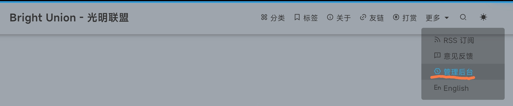
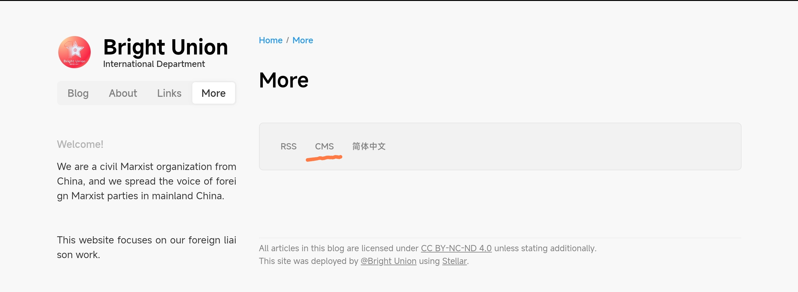

# 进入网站内容管理系统

打开[光明联盟网站](https://www.brightunion.xyz/)/[Bright Union International Department](https://en.brightunion.xyz/)，然后点击`更多`/`More`——[`管理后台`](https://www.brightunion.xyz/admin/)/[`CMS`](https://en.brightunion.xyz/admin/)``

在打开的页面输入管理员给与的邮箱和密码，即可登录后台。

